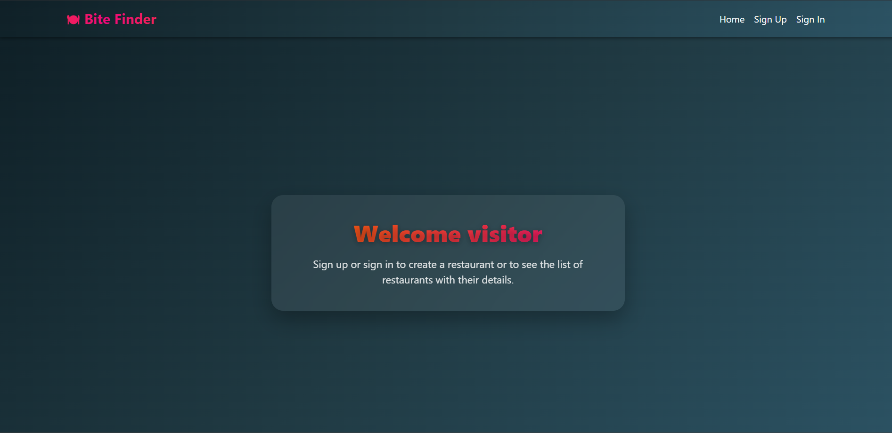

# Bite Finder



Bite Finder is a web application designed to help users discover and explore  restaurants. Users can browse, search, and view details of restaurants, making it easier to find new dining experiences. Our team built this app to provide an intuitive and interactive platform for food enthusiasts and casual diners alike.

---

## Getting Started

- **Deployed App:** [View Bite Finder Online](https://bite-finder-front-end.vercel.app/)  
- **Planning Materials:** [View Planning Docs](https://trello.com/b/H9fdLLQf/project-3)  
- **Back-End Repository:** [View Back-End Code](https://github.com/Sayed-Ali-GA/bite-finder-back-end)

---

## Technologies Used

- JavaScript 
- React
- CSS 
- Bootstrap(react-bootstrap)
- Node.js
- Express.js
- Heroku
- Mongodb

---
## Dependencies

```JSON
 {
    "bootstrap": "^5.3.7",
    "dotenv": "^17.2.1",
    "mapbox-gl": "^3.14.0",
    "react": "^19.1.0",
    "react-bootstrap": "^2.10.10",
    "react-dom": "^19.1.0",
    "react-map-gl": "^7.0.15",
    "react-router-dom": "^7.7.1"
  },
  ```

## Attributions

- [Google Fonts](https://fonts.google.com/) 

- [Mapbox](mapbox.com)

---

## Next Steps

- Adding the option to sign up or sign in withe google 
- Implement user reviews and ratings  
- Improve mobile responsiveness  
- Add filtering and sorting options for easier search  

## Landing Page


<!-- ## Sign up


## Sign in


## Restaurant List

## Restaurant Details

## Menu 
 -->
